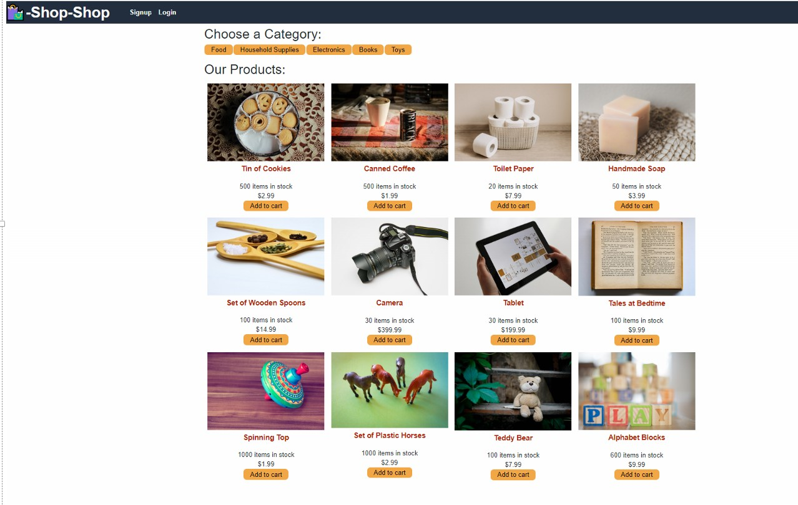
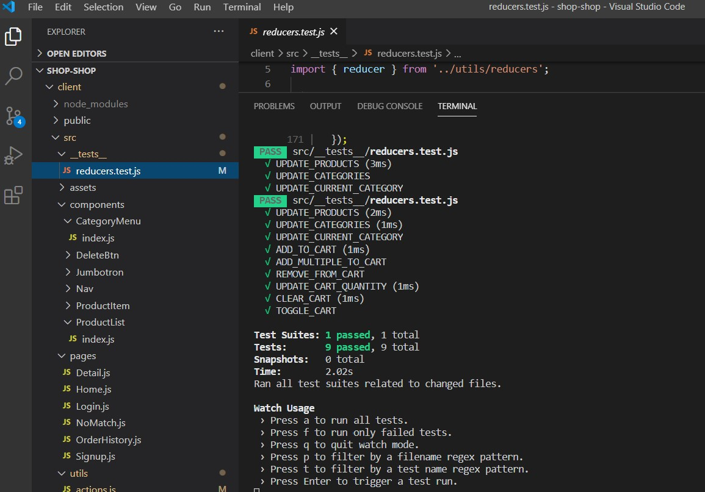
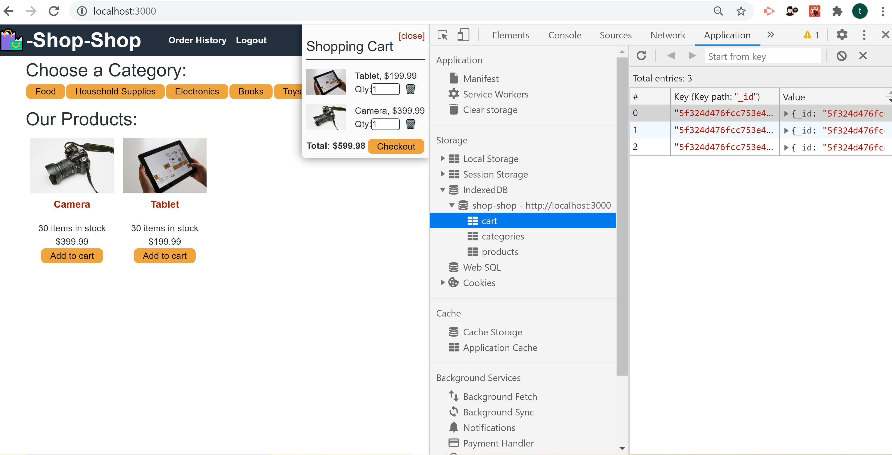
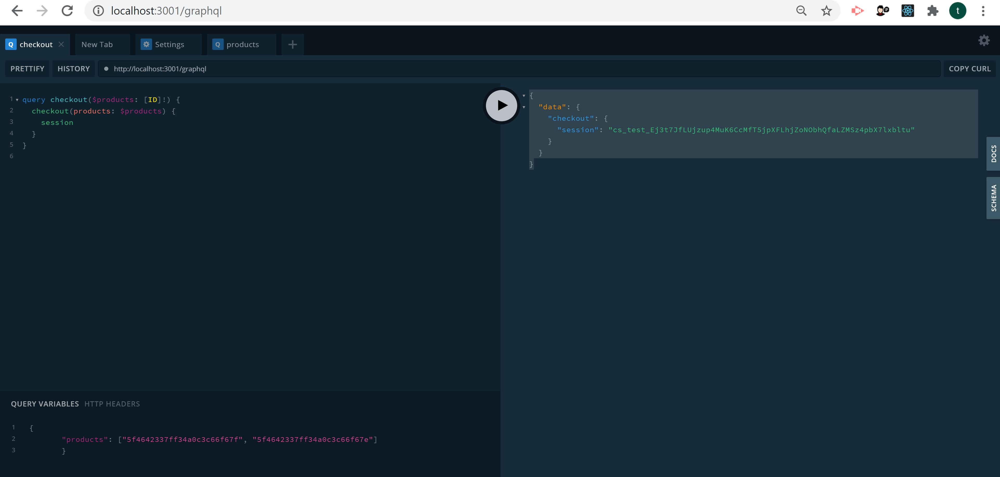
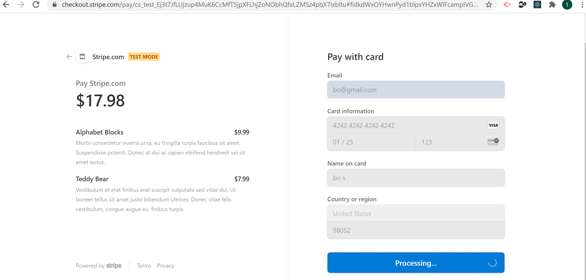

# Redux-Store

E-commerce online application focusing on enhancing an existing website with Redux global state management, offline functionality, and secure online payments through a Stripe API built in a MERN-stack application.

## GitHub URL

- Redux-Store Challenge: https://github.com/ktrnthsnr/Redux-Store

- Shop-Shop Module w\feature working branches: https://github.com/ktrnthsnr/shop-shop

## Heroku website

- Challenge Redux-Shop website: https://ktrnthsnr-redux-store.herokuapp.com/

- Module Shop-Shop website: https://ktrnthsnr-shop.herokuapp.com/

## Table of Contents

* [Description](#description)
* [Technology](#technology)
* [Installations](#installations)
* [Usage](#usage)
* [Testing](#testing)
* [Contribution](#contribution)
* [React](#react)

## Description

Working with an existing application, the enhancements for this e-commerce online codebase have been to: 

1. Completed initial setup of the frontend and backend to receive the product data from the server, with Apollo caching the results.

2. Removed local state management and replaced with global state management within various components (not login\signup) such as CategoryMenu, ProductList and Home - through a Redux-like store implemented by the React Context API, through Redux-like actions and reducers.

3. Added offline capabilities and functionality to persist data by implementing cached server-side data using IndexedDB so a user may continue to shop if temporarily losing internet connectivity. Once back online, the transaction was saved to the MongoDB.

4. Updated code to handle secure online payments coordinated with a Stripe payment service.

5. Updated middleware and front-end GraphQL and React.

## Technology

Node.js, JavaScript, ES6, npm MongoDB, Mongoose, Express.js, React.js, GraphQL, GraphQL Playground, Apollo Server, Apollo-Client, graphql-tag, apollo-server-express, apollo-boost, React Router, react-router-dom, apollo/react-hooks, if-env, concurrently, jsonwebtoken, jwt-decode, faker, nodemon, bcrypt, moment, stripe, @stripe/stripe-js

## Installations

- Prereq: install VSCode, Node.js, and MongoDB
- After cloning the GitHub repo to your local drive, run the following in the VSCode command-line terminal
- Install all components listed within the package.json file for npm
    -  cd to the root, then run
    - $ `npm i` or `npm install`   
    - Seed the MongoDB collections $ `npm run seed`
- Check if all the dependencies were installed, if not you may have to install per the client and server folder.
    - Server 
    - $ `cd server`
    - $ `npm i`
     - Client
    - $ `cd client`
    - $ `npm i`

- Stripe npm installations included
    - cd to the server directory, then run in the bash terminal window 
    - $ `npm install stripe`
    - cd to the client directory, then run in the bash terminal window 
    - $ `npm install @stripe/stripe-js`

## Usage

- If cloning and installing locally, start by running in the terminal bash window,
- $ `npm start`
- This will bring up the development server and browser on your localhost to begin querying
-  Use GraphQL at `http://localhost:3001/graphql`

	
    
- To seed the content, run 
- $ `cd server` then `npm run seed`

### Website
- The website has been deployed to Heroku through an mLab resource add-on at this location:

https://ktrnthsnr-redux-store.herokuapp.com/

## Testing

- Within the client folder, run `npm run test` to run various reducer action tests.

- Jest tests
    - The reducer queries and associated jest tests to add, update, and remove from the categories, products and shopping cart are located under the `client/src/utils/reducers.js` and the tests to validate the functionality of the queries are located under `client/src/__tests__ /reducers.test.js`. 
    - 

- Validating offline functionality through IndexedDB
    - Validate offline functionality is stored in the IndexedDB by starting up DevTools within the Chrome browser (right-click > Inspect or F12), then under the Network tab, change the throttling setting to Offline. Then under devTools, Applications, under the Storage > IndexedDB, view the cart, categories, and products key\value pairs listed under the IDB. Alternatively, you may clone the application and after installations have been completed, cd to the client directory, and run npm start, which will only start the client, not the server, to validate the offline functionality.
    - IndexedDB is storing the data while the application is not connected to the the internet, a setup for performance web application (PWA).
    - .  

- GraphQL Playground
    - To query GraphQL for product detail, see graphql_queries.md for more info and a few samples.
    - 
    - Corresponding Stripe result from the similar IDs
    - 

## Contribution

ktrnthsnr

### ©️2020 ktrnthsnr

## React

This project was bootstrapped with [Create React App](https://github.com/facebook/create-react-app).

## Available Scripts

In the project directory, you can run:

### `npm start`

Runs the app in the development mode. 
Open [http://localhost:3000](http://localhost:3000) to view it in the browser.

The page will reload if you make edits. 
You will also see any lint errors in the console.

### `npm test`

Launches the test runner in the interactive watch mode. 
See the section about [running tests](https://facebook.github.io/create-react-app/docs/running-tests) for more information.

### `npm run build`

Builds the app for production to the `build` folder. 
It correctly bundles React in production mode and optimizes the build for the best performance.

The build is minified and the filenames include the hashes. 
Your app is ready to be deployed!

See the section about [deployment](https://facebook.github.io/create-react-app/docs/deployment) for more information.

### `npm run eject`

**Note: this is a one-way operation. Once you `eject`, you can’t go back!**

If you aren’t satisfied with the build tool and configuration choices, you can `eject` at any time. This command will remove the single build dependency from your project.

Instead, it will copy all the configuration files and the transitive dependencies (webpack, Babel, ESLint, etc) right into your project so you have full control over them. All of the commands except `eject` will still work, but they will point to the copied scripts so you can tweak them. At this point you’re on your own.

You don’t have to ever use `eject`. The curated feature set is suitable for small and middle deployments, and you shouldn’t feel obligated to use this feature. However we understand that this tool wouldn’t be useful if you couldn’t customize it when you are ready for it.

## Learn More

You can learn more in the [Create React App documentation](https://facebook.github.io/create-react-app/docs/getting-started).

To learn React, check out the [React documentation](https://reactjs.org/).

### Code Splitting

This section has moved here: https://facebook.github.io/create-react-app/docs/code-splitting

### Analyzing the Bundle Size

This section has moved here: https://facebook.github.io/create-react-app/docs/analyzing-the-bundle-size

### Making a Progressive Web App

This section has moved here: https://facebook.github.io/create-react-app/docs/making-a-progressive-web-app

### Advanced Configuration

This section has moved here: https://facebook.github.io/create-react-app/docs/advanced-configuration

### Deployment

This section has moved here: https://facebook.github.io/create-react-app/docs/deployment

### `npm run build` fails to minify

This section has moved here: https://facebook.github.io/create-react-app/docs/troubleshooting#npm-run-build-fails-to-minify
